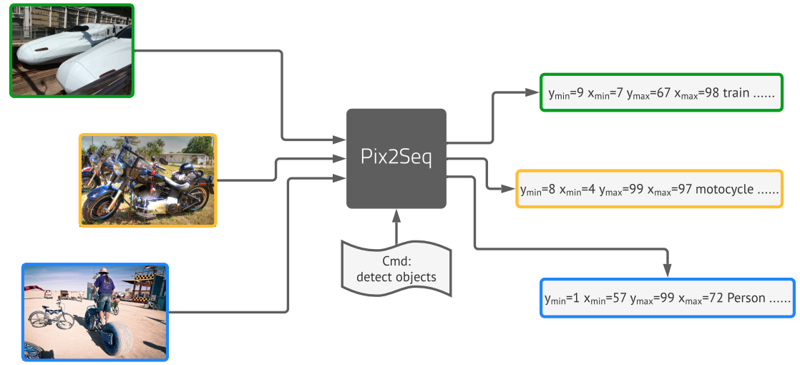

# Pix2Seq - A general framework for turning RGB pixels into semantically meaningful sequences



## Models
<a href="https://colab.research.google.com/github/google-research/pix2seq/blob/master/colabs/pix2seq_inference_object_detection.ipynb" target="_parent"></a>

### Objects365 object detection pretrained checkpoints

Backbone       | Total params (M) | Image size | Google cloud storage location
-------------: | ---------------: | ---------: | -----------:
ResNet-50      | 36.6             | 640x640    | [gs://pix2seq/obj365_pretrain/resnet_640x640_b256_s400k](https://console.cloud.google.com/storage/browser/pix2seq/obj365_pretrain/resnet_640x640_b256_s400k)
ResNet-50 (C4) | 84.7             | 640x640    | [gs://pix2seq/obj365_pretrain/resnetc_640x640_b256_s400k](https://console.cloud.google.com/storage/browser/pix2seq/obj365_pretrain/resnetc_640x640_b256_s400k)
ViT-L          | 115.2            | 640x640    | [gs://pix2seq/obj365_pretrain/vit_b_640x640_b256_s400k](https://console.cloud.google.com/storage/browser/pix2seq/obj365_pretrain/vit_b_640x640_b256_s400k)
ViT-B          | 341.2            | 640x640    | [gs://pix2seq/obj365_pretrain/vit_l_640x640_b256_s400k](https://console.cloud.google.com/storage/browser/pix2seq/obj365_pretrain/vit_l_640x640_b256_s400k)


### COCO object detection fine-tuned checkpoints

Backbone       | Total params (M) | Image size | COCO AP   | Google cloud storage location
-------------: | ---------------: | ---------: | --------: | -----------:
ResNet-50      | 36.6             | 640x640    | 39.1      | [gs://pix2seq/coco_det_finetune/resnet_640x640](https://console.cloud.google.com/storage/browser/pix2seq/coco_det_finetune/resnet_640x640)
ResNet-50      | 36.6             | 1024x1024  | 41.7      | [gs://pix2seq/coco_det_finetune/resnet_1024x1024](https://console.cloud.google.com/storage/browser/pix2seq/coco_det_finetune/resnet_1024x1024)
ResNet-50      | 36.6             | 1333x1333  | 42.6      | [gs://pix2seq/coco_det_finetune/resnet_1333x1333](https://console.cloud.google.com/storage/browser/pix2seq/coco_det_finetune/resnet_1333x1333)
ResNet-50 (C4) | 84.7             | 640x640    | 44.7      | [gs://pix2seq/coco_det_finetune/resnetc_640x640](https://console.cloud.google.com/storage/browser/pix2seq/coco_det_finetune/resnetc_640x640)
ResNet-50 (C4) | 84.7             | 1024x1024  | 46.9      | [gs://pix2seq/coco_det_finetune/resnetc_1024x1024](https://console.cloud.google.com/storage/browser/pix2seq/coco_det_finetune/resnetc_1024x1024)
ResNet-50 (C4) | 84.7             | 1333x1333  | 47.3      | [gs://pix2seq/coco_det_finetune/resnetc_1333x1333](https://console.cloud.google.com/storage/browser/pix2seq/coco_det_finetune/resnetc_1333x1333)
ViT-B          | 115.2            | 640x640    | 44.2      | [gs://pix2seq/coco_det_finetune/vit_b_640x640](https://console.cloud.google.com/storage/browser/pix2seq/coco_det_finetune/vit_b_640x640)
ViT-B          | 115.2            | 1024x1024  | 46.5      | [gs://pix2seq/coco_det_finetune/vit_b_1024x1024](https://console.cloud.google.com/storage/browser/pix2seq/coco_det_finetune/vit_b_1024x1024)
ViT-B          | 115.2            | 1333x1333  | 47.1      | [gs://pix2seq/coco_det_finetune/vit_b_1333x1333](https://console.cloud.google.com/storage/browser/pix2seq/coco_det_finetune/vit_b_1333x1333)
ViT-L          | 341.2            | 640x640    | 47.6      | [gs://pix2seq/coco_det_finetune/vit_l_640x640](https://console.cloud.google.com/storage/browser/pix2seq/coco_det_finetune/vit_l_640x640)
ViT-L          | 341.2            | 1024x1024  | 49.2      | [gs://pix2seq/coco_det_finetune/vit_l_1024x1024](https://console.cloud.google.com/storage/browser/pix2seq/coco_det_finetune/vit_l_1024x1024)
ViT-L          | 341.2            | 1333x1333  | 50.0      | [gs://pix2seq/coco_det_finetune/vit_l_1333x1333](https://console.cloud.google.com/storage/browser/pix2seq/coco_det_finetune/vit_l_1333x1333)


## Usage

### Colabs

See [colabs](colabs) for inference and fine-tuning (to be added soon) demos.


### Basic setup before running the code

The following setup is required before running the code.
```
git clone https://github.com/google-research/pix2seq.git
pip install -r requirements.txt
```

Download COCO annotations if neccesary (note that COCO images will be automatically downloaded by [TFDS](https://www.tensorflow.org/datasets)).
```
wget -c http://images.cocodataset.org/annotations/annotations_trainval2017.zip
unzip annotations_trainval2017.zip
```

(Optional) If accessing the pretrained checkpoints in cloud slows down the start of training/eval, you can download them mannually with following command `gsutil cp -r gs://folder .`.

(Optional) If training doesn't start (due to NcclAllReduce error) or starts very slowly (due to graph building), try a different `cross_device_ops` for `tf.distribute.MirroredStrategy` in utils.py:build_strategy function.

### Instructions for training (fine-tuning) of objedct detection models.

Below is the instruction for starting a training job, where we've set up a configuration mainly for fine-tuning the objects365 pretrained models.

Step 1: check and update configurations in configs/config_det_finetune.py, such as `encoder_variant`, `image_size`.

Step 2: run `python3 run.py --mode=train --model_dir=/tmp/model_dir --config=configs/config_det_finetune.py --config.dataset.coco_annotations_dir=/path/to/annotations --config.train.batch_size=32 --config.train.epochs=20 --config.optimization.learning_rate=3e-5`.

(Optional) Setup tensorboard for training curves with `tensorboard --logidr=/tmp/model_dir`.


### Instructions for evaluation of object detection models.

Below is the instruction for starting an evaluation job, which monitors the specified directory and perform evaluation for latest and un-evaluated checkpoints. It can be started in parallel to or after the training.

Step 1: check and update configurations in configs/config_det_finetune.py, such as `encoder_variant`, `image_size`. Set `checkpoint_dir` if neccesary (e.g., evaluating our provided fine-tuning checkpoints).

Step 2: run `python3 run.py --mode=eval --model_dir=/tmp/model_dir --config=configs/config_det_finetune.py --config.dataset.coco_annotations_dir=/path/to/annotations --config.eval.batch_size=40`.

(Optional) Setup tensorboard for eval curves and detection visualizations with `tensorboard --logidr=/tmp/model_dir`.


## Cite

[Pix2seq paper](https://arxiv.org/abs/2109.10852):

```
@article{chen2021pix2seq,
  title={Pix2seq: A language modeling framework for object detection},
  author={Chen, Ting and Saxena, Saurabh and Li, Lala and Fleet, David J and Hinton, Geoffrey},
  journal={arXiv preprint arXiv:2109.10852},
  year={2021}
}
```


## Disclaimer
This is not an officially supported Google product.
